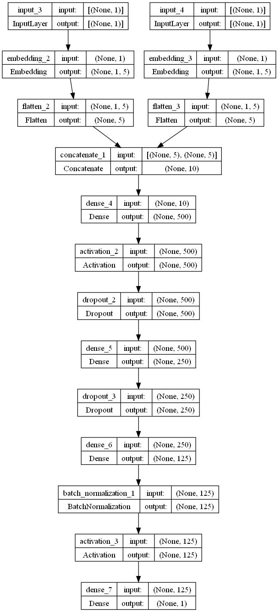

### Overview

The film industry has historically experienced fluctuations of both booms and busts. However, with the advent of streaming services like Netflix and Disney+, films and movies are continually gaining popularity and more exposure through such streaming services. The author, hence, chose to explore into data revolving the movie industry. 

### Problem Statement

The [paradox of choice](https://modelthinkers.com/mental-model/paradox-of-choice#:~:text=The%20paradox%20of%20choice%20is,ability%20to%20make%20a%20decision) is a phenomenon where an abundance of options can counterintuitively lead to less happiness, less satisfaction, and hamper the ability to make a decision.
As we usher in an information era, the average consumer is often times overloaded with data and information and hence, the importance of distilling and presenting key, relevant information has become more important than ever. Recommender engines play a key role in today's information-rich climate, hence I chose to explore deeper into the application of recommender engines, particularly on readily-available datasets such as the IMDb dataset and the Movie Lens 1m dataset.

### Objective of the Project
With the problem statements setting the context of the project, its objectives are therefore to
1. Build recommender engines that can streamline the decision making processes
2. Conduct some exploratory data analysis on the existing datasets to uncover insights that can appeal to stakeholders in the movie industry

### Datasets

There are 2 datasets included in the [`data`](./Capstone_Project/data/) folder for this project. 

* [IMDb dataset](./data/movies2013-2023.parquet): The IMDb dataset, which is primarily used for data analysis and the cosine similarity recommendation algorithm.
* [Movie Lens 1m dataset](./data/ML1m_merged.parquet): A dataset retrieved from Group Lens, primarily to train a user-based collaborative filtering model

### Recommender Engine
I created 2 recommender engines (non-personalised attribute based engine, and a user-based collaborative filtering engine), hosted on the 'Recommend Me!' page of the Streamlit application.

#### What goes on under the hood
##### Cosine Similarity Algorithm
The first recommender engine uses a combination of **cosine similarity** (based on the genres selected), followed by filtering out the **top 20 most similar selections** when compared with the 2 user inputs. Next, selections that have **ratings of less than 5 stars are automatically filtered out**, follwed by resorting the selection by the **recommendation propensity** column of the dataset.
  
The recommendation propensity is determined by 

$$recommendationpropensity = popularityscore - k*\frac{ageoffilm}{yearrange}$$

and 

$$popularityscore = R*\frac{v}{v+m} + C * \frac{m}{v+m}$$

  
The popularity score takes into consideration: 
v = number of votes of the movie,  
R is the average/mean rating of the movie,  
m is the minumum votes required for the movie to be considered (ie 1000)  
C is the average/mean rating across all movies  

And the recommendation propensity score takes into account the popularity score, together with a penalizing term of $$k*\frac{ageoffilm}{yearrange}$$, 
where k is an arbitrary constant,  
year range is, in years, the difference between the earliest and most recent film for the dataset considered,  
and age of film is taken relative to the earliest film of the dataset.  

#### Popularity score
m is added to the denominator of the first term to reduce the weightage the mean rating has on the overall popularity score, as well as increase the weightage of the global mean rating in the second term. In other words, should there be too few voters of a particular movie, the popularity score of the movie will tend closer to the global mean across all movies.

#### Recommendation propensity
The recommendation propensity further takes into account the time factor, with the consideration that older movies may not be as enjoyed as newer movies. Hence, a penalising factor is added to reduce the popularity score, with k being varied to adjust the penalization strength.

##### User-Based Collaborative Filtering model using Tensorflow

Using the Movie Lens 1m dataset, I built a user-based collaborative filtering model. The model had a validaton MSE of 0.94, and had the above model architecture. The model takes 2 inputs, a user id and a movie id, and then is passed through several layers, which includes:
1. An embedding layer for each input with a latent dimension of 5
2. A flattening and concatenation layer
3. A series of Dense and Dropout layers alternated
4. A normalization layer before finally outputting a predicted rating
5. A Rectified Linear Unit activation function
